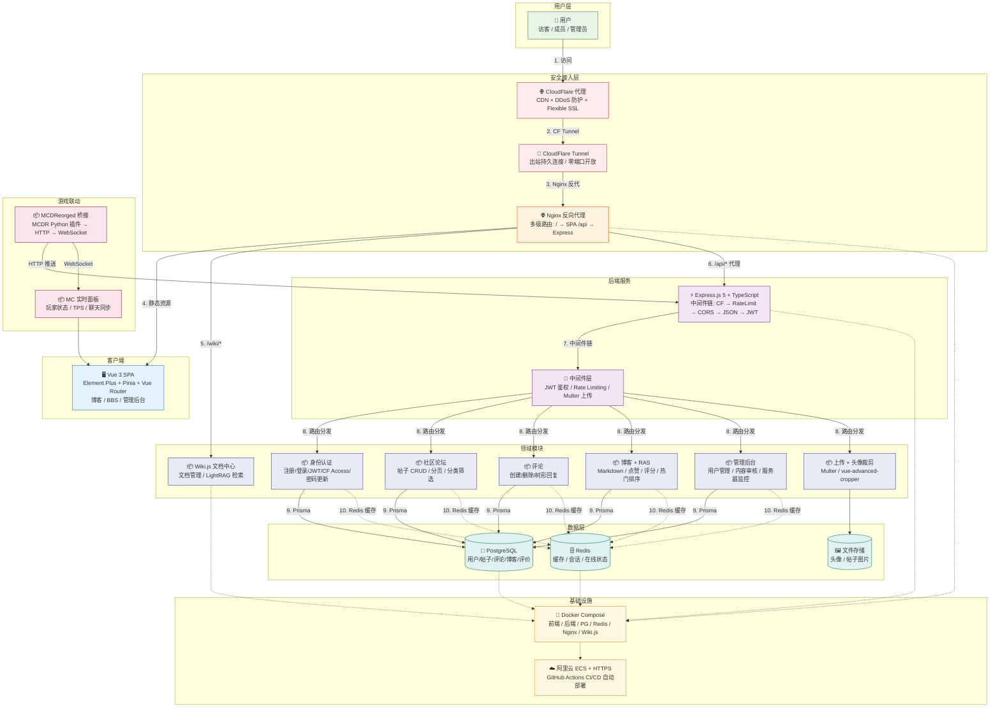

# Ourgensokyo 平台架构

> 系统架构图 + 模块职责说明 + 请求链路
> 对齐简历承诺：PostgreSQL / Redis / Docker / ECS / Wiki.js / LightRAG / MCDR / CF Access

---

## 一、架构总览

## 二、请求链路

| 步骤 | 说明 |
|------|------|
| 1 | 用户访问域名，DNS 解析到 CloudFlare |
| 2 | CF 边缘节点处理 HTTPS，通过 Tunnel 转发到服务器 |
| 3 | cloudflared 接收请求，转发到本地 Nginx:80 |
| 4 | Nginx 分发：静态资源 → Vue SPA，/api/* → Express |
| 5 | Vue SPA 渲染后，Axios 请求 `/api/*` 回 Nginx |
| 6 | Nginx 反向代理到 Express，过中间件链：Rate Limit → CORS → JSON → JWT |
| 7 | 控制器处理业务逻辑，Prisma 操作 PostgreSQL，Redis 缓存热数据 |

## 三、模块职责

| 模块 | 职责 | 简历关键词 |
|------|------|-----------|
| 身份认证 | 注册/登录/JWT/CF Access/密码更新 | JWT + bcrypt + CloudFlare |
| 社区论坛 | 帖子 CRUD/分页/分类筛选 | CRUD 基础 |
| 评论 | 创建/删除/树形回复 | 关系型数据设计 |
| 博客 + RAS | Markdown 文章/点赞评分/热门排序 | 业务逻辑 + 算法 |
| 管理后台 | 用户管理/帖子审核/服务器监控 | 权限管理 |
| 上传 + 裁剪 | 文件上传/头像裁剪组件 | Multer / 前端组件 |
| Wiki.js 文档 | 文档管理/多语言/LightRAG 语义检索 | 文档 + AI 检索 |
| MCDR 桥接 | Python 插件监听 MC 事件/HTTP 推送 | Python + 协议对接 |
| MC 面板 | WebSocket 实时推送/玩家状态/聊天同步 | WebSocket + 实时 |
| CloudFlare Tunnel | 零端口出站连接/绕过运营商端口封锁 | DevOps + 网络工程 |

## 四、简历技术点覆盖

| 简历写到的 | 架构中的位置 |
|-----------|-------------|
| Node.js + Express + Prisma | 后端服务 + Prisma ORM |
| PostgreSQL + Redis | 数据层双存储 |
| Docker + ECS 容器化部署 | 基础设施层 |
| JWT + bcrypt + CF Access | 安全接入层 |
| Wiki.js 文档中心 | 领域模块 /wiki |
| LightRAG 语义检索 | Wiki.js 模块中集成 |
| MCDReorged HTTP 桥接 | 游戏联动模块 |
| 管理后台 | 领域模块 Admin |
| CloudFlare Tunnel | 安全接入层 |
| Nginx 反代与多级路由 | Nginx 层 |
